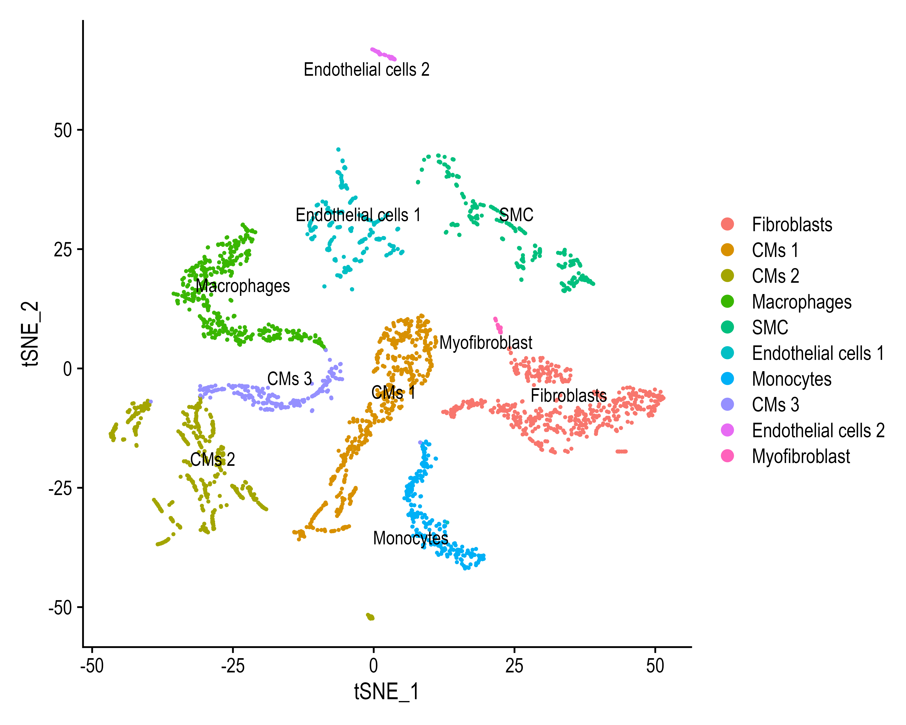
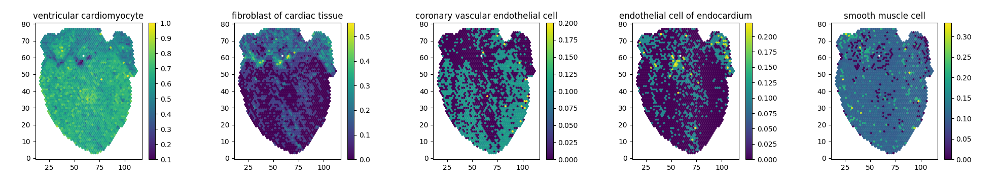
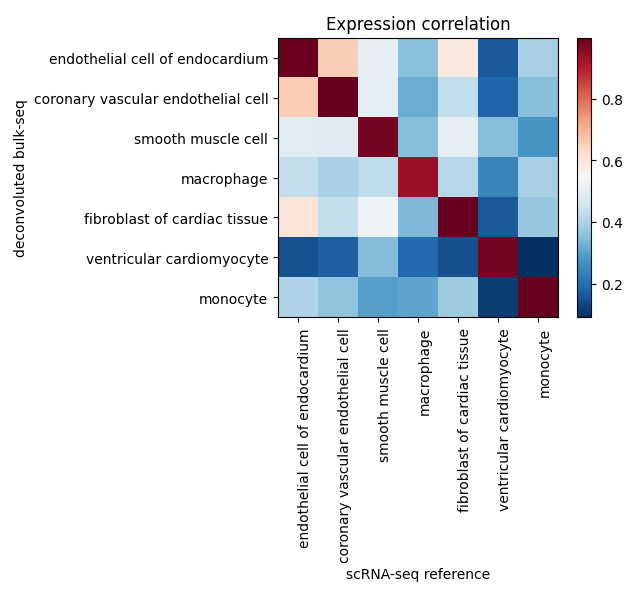
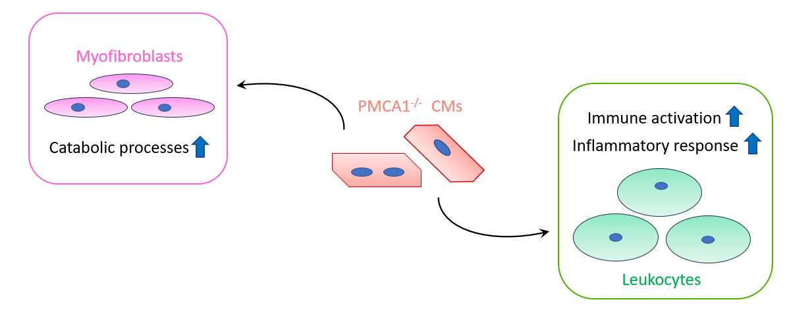

# PhD Thesis Code

## Overview

This repository contains all the analyses, scripts, and relevant materials from my PhD research in Cardiovascular Science at the University of Manchester. The goal is to provide transparency, share findings, and contribute to the broader scientific community.

The work encompasses a range of analyses, experiments, and scripts in both R and Python using relevant data science and bioinformatics packages:

- Python: pandas, numpy, matplotlib, seaborn, scipy and sklearn for Machine Learning.
- R: Seurat, tidyverse, DESeq2, EnhancedVolcano and PCAtools. 

## Table of Contents

1. [Introduction](#introduction)
2. [Research Highlights](#research-highlights)
3. [Repository Structure](#repository-structure)
4. [Usage](#usage)
5. [Dependencies](#dependencies)
6. [About](#about)

## Introduction

This repository serves as a comprehensive resource of code written throught the research conducted during my PhD. My research focussed on a calcium pump called Plasma Membrane Calcium ATPase 1 (PMCA1). This genes is linked to cardiovascular disease and my aim was to understand why and how this is happening. To better understand the role of PMCA1, I generated and analysed bulk RNA-Seq data from mouse hearts. This provided an overview of what pathological genes and pathways PMCA1 is affecting in the heart.

Moreover, I expanded my analysis by looking at how PMCA1 is affecting individual cells. To do so, I used a novel deep learning deconvolution method to extrapolate single cell information from the bulk transcriptome. Effectively, I was able to generate scRNA-Seq from bulk RNA-Seq. Lastly, I resolved the single cell genetic information on a tissue section, restoring spatial information and effectively generating and analysing Spatial Transcriptomics data.

## Research Highlights

Here are some key highlights of the research included in this repository:

- **Cellular Composition of the Heart**
  - Deconvoluting the bulk RNA-Seq dataset into single cells revealed that the most abundant cell population is cardiomyocytes, followed by fibroblasts, endothelial cells, immune cells and smooth muscle cells.

- **Accurate Biological Recapitulation of Cardiac Cells**
  - Validation results of the deep learning model showed biologically accurate generation of cardiac cells, with a high genetically correlated similarity to real ones.

- **The Paracrine Effect of PMCA1**
  - PMCA1 may affect activation of myofibroblasts and immune cells in a paracrine fashion.

## Repository Structure

The repository is organized as follows:

- **`data/`**: Samples of raw and processed data used in the analyses.
- **`scripts/`**: Curated and commented code scripts for data preprocessing, analysis, and visualization. 
- **`results/`**: Output files, figures, and tables generated during the analyses.
- **`docs/`**: Documentation files, including the relevant thesis methods sections and any supplementary materials.

Feel free to explore each directory for more detailed information.

## Usage

To explore or reproduce any part of the analysis, navigate to the relevant directory (e.g., `scripts/`) and run the scripts using Python, R, or any other applicable tools.

## Dependencies

Ensure you have the following dependencies installed before running the scripts:

- Python (version >= 3.8)         
  
- R (version 4.1.3)       

Install additional dependencies using the provided `dependencies.txt`.

## About

Should you have any questions, feel free to contact me at chelu.alex@hotmail.com.
